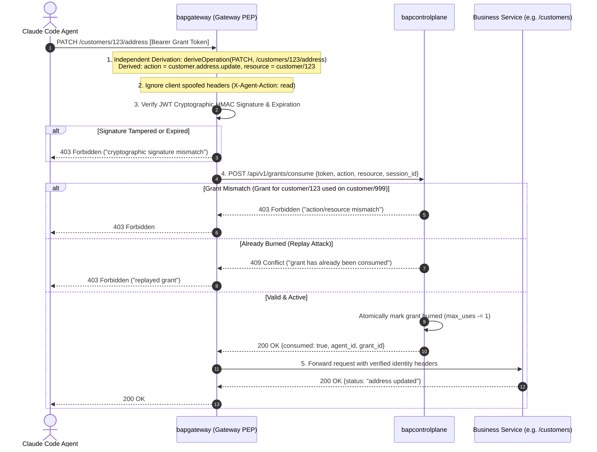
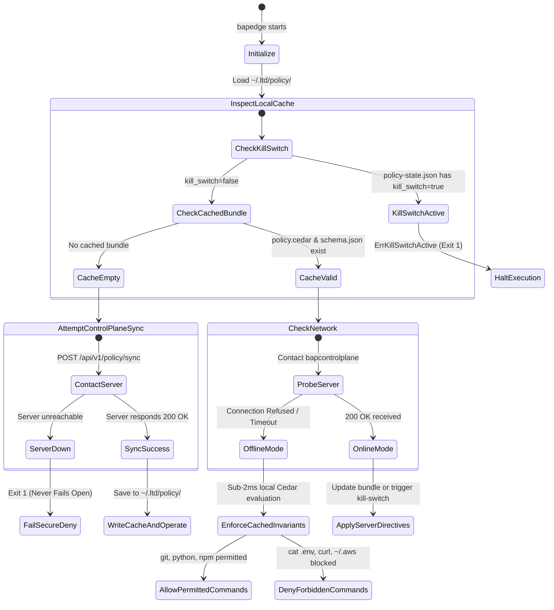
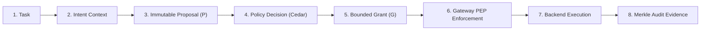
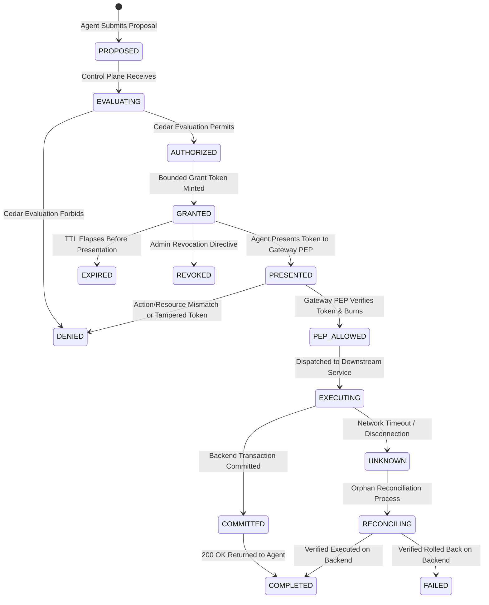
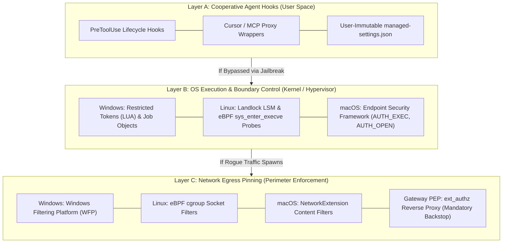
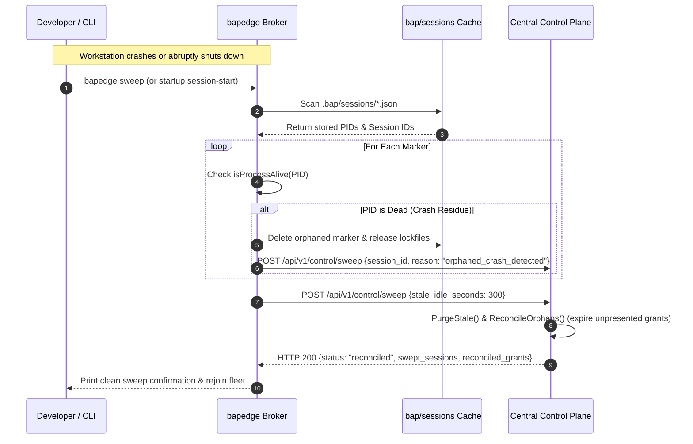
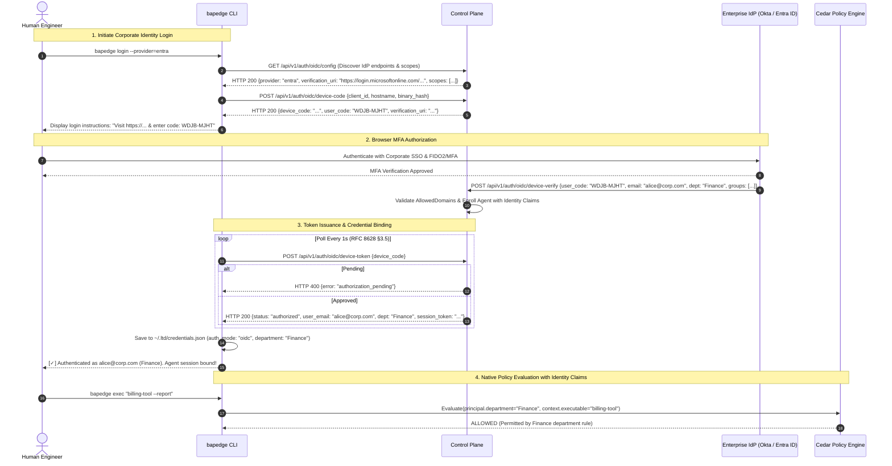
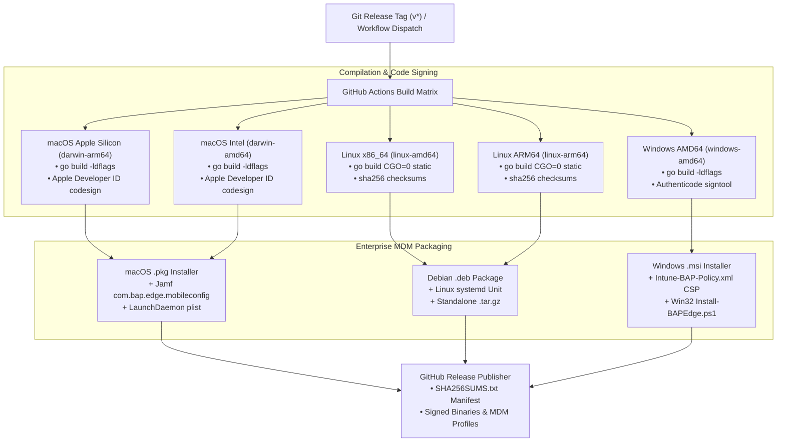

# Architecture & Technical Design: Bounded Authority Plane (BAP)

This document specifies the technical architecture, security model, component design, cryptographic protocols, and operational state machines of the **Bounded Authority Plane (BAP)**.

---

## 1. Executive Architecture & Invariants Core

The Bounded Authority Plane (BAP) enforces zero-trust execution boundaries, cryptographic attestation, and least-privilege authority over AI developer agents (such as Claude Code, GitHub Copilot CLI, and autonomous worker agents).

### 1.1. The Five Foundational Invariants (Frozen Baseline)

The entire BAP architecture is anchored on five inviolable architectural invariants:

> **I1 — Intent is context, never authority.**  
> An agent declaring intent to "update customer 123" does not grant executable privilege to write, cancel, or modify resources. Intent provides context for policy evaluation and audit evidence, never executable permission.

> **I2 — `bap-edge` determines what authority an agent may obtain; it is not assumed to execute every resulting operation.**  
> `bap-edge` evaluates local policy and brokers requests, but cannot be assumed to observe or execute every downstream HTTP/RPC call. Local intent or policy approval alone is never proof that an actual operation was authorized.

> **I3 — Actual protected operations are independently enforced at a resource-side PEP against bounded authority.**  
> Business APIs and microservices are protected by gateway Policy Enforcement Points (PEP) that derive actual actions from trusted request characteristics (HTTP method, route, parameters), validating bounded cryptographically signed grants.

> **I4 — Control Plane owns master policy, lifecycle, and centralized state; ordinary authorization must not unnecessarily depend on a synchronous Control Plane round-trip.**  
> The Control Plane distributes signed, immutable policy bundles. High-throughput edge decisions evaluate locally cached policies in sub-2ms; only operations requiring mutable state (e.g. single-use atomic consumption) hit central state.

> **I5 — Observability establishes causality and evidence across Runtime → Authority → PEP → Execution, but telemetry itself is never treated as authorization.**  
> The Observability Plane reconstructs the end-to-end timeline for forensic integrity, but telemetry reporting or health signals never substitute for cryptographic authorization tokens.

---

## 2. System Topology: The Four Operating Planes

BAP is architected into four decoupled, resilient operational planes:

```mermaid
graph TD
    subgraph Central_Control ["1. Control Plane (bapcontrolplane)"]
        CP["bapcontrolplane Core"]
        REG["Agent Registry & SPIFFE SVID Engine"]
        ATTEST["Binary Hash Attestation Store"]
        MINTER["Cryptographic Grant Minter (HMAC-SHA256)"]
        BUNDLE["Authoritative Cedar Policy Store & Sync"]
        BURNER["Atomic Grant Burner (max_uses=1)"]
        AUDIT_CHAIN["Tamper-Evident Merkle Hash Chain (SHA-256)"]
        SESS["Session Lifecycle & Live Radar"]
        
        CP --> REG
        CP --> ATTEST
        CP --> MINTER
        CP --> BUNDLE
        CP --> BURNER
        CP --> AUDIT_CHAIN
        CP --> SESS
    end

    subgraph Edge_Brokerage ["2. Edge Execution Plane (bapedge / Hooks)"]
        subgraph Agents ["AI Agent Runtimes"]
            CLAUDE["Claude Code CLI"]
            COPILOT["GitHub Copilot CLI"]
            WORKER["Autonomous Worker Agent (Python SDK)"]
        end

        subgraph Interceptors ["Managed Interception Layer"]
            CCHOOK["Claude Code Hook (cchook/interceptor.exe)"]
            COPSHIM["Copilot Adapter (copilot_interceptor.exe)"]
        end

        subgraph Edge_Daemon ["bapedge - Local Execution Broker (LTD)"]
            EDGE_PEP["Local Policy Enforcement Point (PEP)"]
            CEDAR_LOCAL["In-Process Cedar Engine (<2ms)"]
            STORE_LOCAL["PolicyStore Cache (~/.ltd/policy/)"]
            AUDIT_LOCAL["Append-Only Local Logger (ltd-audit.jsonl)"]
            CLASSIFIER["Deterministic Intent Classifier (11 Rules)"]
        end

        CLAUDE -->|PreToolUse / UserPromptSubmit| CCHOOK
        COPILOT -->|CLI Argument Intercept| COPSHIM
        WORKER -->|bap_sdk API| EDGE_PEP

        CCHOOK --> EDGE_PEP
        COPSHIM --> EDGE_PEP
        EDGE_PEP --> CEDAR_LOCAL
        CEDAR_LOCAL --> STORE_LOCAL
        EDGE_PEP --> AUDIT_LOCAL
        CCHOOK --> CLASSIFIER
    end

    subgraph Resource_PEP ["3. Resource Enforcement Plane (bapgateway)"]
        GW_PEP["bapgateway (Zero-Trust Gateway PEP)"]
        EXT_AUTHZ["Envoy / Istio ext_authz Proxy Semantics"]
        DERIVE["Authoritative Operation Derivation (deriveOperation)"]
        BACKEND_API["Protected Microservices (Financial Records, Banking, DB)"]

        GW_PEP --> DERIVE
        GW_PEP --> EXT_AUTHZ
        EXT_AUTHZ -->|Verified 200 OK| BACKEND_API
    end

    subgraph Observability_Plane ["4. Observability & Forensic Plane"]
        COCKPIT["CIO Fleet Command Cockpit (Live Radar)"]
        TIMELINE["Causal Evidence Reconstruction Engine"]
        COLLECTOR["Audit Log Aggregator"]
        
        COCKPIT --> TIMELINE
        TIMELINE --> COLLECTOR
    end

    %% Cross-Plane Comms
    EDGE_PEP <-->|Sub-2ms Local Policy Sync| BUNDLE
    EDGE_PEP -->|Ingest Prompt & Tool Events| AUDIT_CHAIN
    EDGE_PEP <-->|Acquire Bounded Grant Token| MINTER
    
    Agents -->|HTTP Requests with Grant Bearer Token| GW_PEP
    GW_PEP <-->|POST /api/v1/grants/consume (Atomic Burn)| BURNER
    GW_PEP -->|Audit Decision Telemetry| AUDIT_CHAIN
    AUDIT_CHAIN --> COLLECTOR
```

---

## 3. Component Deep Dive

### 3.1. Plane 1: Control Plane (`bapcontrolplane`)

`bapcontrolplane` is the authoritative root of trust for policy, identity, and lifecycle state:

1. **Central Policy Master (BAP-401):**
   - Authoritative source for all Cedar policies. Policies receive immutable version IDs (e.g. `v1-digest`, `v2-digest`).
   - Distributes cryptographically signed bundles. Edge runtimes verify signatures and reject unauthenticated or tampered policy files.
   - Supports zero-downtime policy distribution and instantaneous rollback without restarting agent processes.
2. **Workload Identity & SPIFFE SVID (BAP-403, BAP-404):**
   - Issues cryptographically verified SPIFFE IDs formatted as:
     $$\text{spiffe://}\{\text{trust\_domain}\}/\text{app}/\{\text{app\_id}\}/\text{instance}/\{\text{instance\_id}\}$$
   - Rotates credentials every 5 minutes over mutual TLS (mTLS). SVID rotation does not terminate active healthy sessions.
3. **Cryptographic Bounded Grant Minter (BAP-407, BAP-408):**
   - Issues short-lived, cryptographically bounded tokens encapsulating:
     - `jti`: Unique UUID grant identifier.
     - `sub`: Agent SPIFFE workload identity.
     - `session_id`: Unique developer session identifier.
     - `human_id`: Authenticated user email/ID on whose behalf the agent acts.
     - `action`: Specific allowed operation (e.g. `customer.address.update`).
     - `resource`: Specific canonical resource URI (e.g. `customer/123`).
     - `constraints`: `max_uses: 1`, `max_amount`, cumulative limits.
     - `exp`: Strict ephemeral TTL (default: 30–60 seconds for single actions).
     - `policy_version`: Policy bundle hash active when granted.
4. **Atomic Mutable State Burning (BAP-417, BAP-419):**
   - Houses the centralized mutex-locked consumption store (`consumeActiveGrantWithDetails`).
   - Guarantees that ten simultaneous parallel requests against a `max_uses=1` grant result in **at most one** successful consumption; nine requests are rejected.
5. **Tamper-Evident Merkle Hash Chain (BAP-221, BAP-433):**
   - Every ingested event is hashed with the prior block's hash:
     $$H_n = \text{SHA256}(H_{n-1} \parallel \text{EventJSON})$$
   - Any manual edit to historical database rows breaks the chain, causing `/api/v1/control/chain/verify` to report `valid: false`.

---

### 3.2. Plane 2: Edge Execution Broker (`bapedge` & Hooks)

`bapedge` enforces local execution boundaries directly on developer workstations or CI containers:

1. **Sole Executor Pattern (BAP-200, BAP-421):**
   - Agents are deprived of unmediated shell execution. Command execution occurs exclusively via broker-owned wrappers:
     ```bash
     bapedge exec --source claude-code --session-id <sess_id> --cmd-b64 <base64_payload>
     ```
   - Agent-authored lookalikes or direct process-spawning bypasses are strictly rejected.
2. **In-Process Cedar Policy Engine (BAP-101, BAP-402):**
   - Evaluates AWS Cedar policies in-process in **$<1.5\text{ms}$**, completely eliminating remote RPC latency during coding tasks.
   - Evaluates principal, action, resource, and context locally using cached policy bundles.
3. **Offline Fail-Secure Architecture (BAP-102, BAP-434):**
   - If the Control Plane is offline or partitioned, `bapedge` continues enforcing verified cached policies in `~/.ltd/policy/`.
   - If no valid policy cache exists, it fails secure (`exit code 1`). It **never fails open**.
4. **Deterministic Intent Classifier (BAP-218, BAP-405, BAP-406):**
   - Evaluates user prompts against 11 canonical CIO categories:
     `BUG_FIX`, `DATABASE_CHANGE`, `FEATURE_ENHANCEMENT`, `INVESTIGATION`, `REFACTOR`, `TEST_VERIFICATION`, `DOCUMENTATION`, `MIGRATION`, `DEPLOYMENT_RELEASE`, `WORK_MANAGEMENT`, `SECURITY_REMEDIATION`.
   - Ambiguous or unclassified prompts fail safely to `UNKNOWN` ($0.0$ confidence), which explicitly forces human approval or restricted execution rather than silent privilege escalation.
5. **Anti-Tampering Asset Guard (BAP-200A, BAP-425):**
   - Blocks any agent attempt to read credentials (`.env`, `.aws`, `.ssh`), tamper with BAP assets (`policy.cedar`, `bap-config.json`, `interceptor.exe`), or perform directory traversal outside the authorized workspace.

---

### 3.3. Plane 3: Resource Enforcement Plane (`bapgateway`)

`bapgateway` acts as the independent Zero-Trust Policy Enforcement Point (PEP) guarding enterprise business APIs:



#### Key Gateway PEP Invariants:
1. **Independent Operation Derivation (`deriveOperation`):**
   The gateway inspects the HTTP verb and path to derive authoritative actions and resources:
   ```go
   func deriveOperation(method, path string) (action, resource string) {
       cleanPath := strings.TrimRight(path, "/")
       if strings.HasPrefix(cleanPath, "/api/v1/financial-records") {
           if method == http.MethodGet {
               return "financial.records.read", "/api/v1/financial-records"
           }
           return "financial.records.write", "/api/v1/financial-records"
       }
       if strings.HasPrefix(cleanPath, "/api/v1/core-banking") {
           if method == http.MethodPost {
               return "core_banking.transfer", cleanPath
           }
           return "core_banking.read", cleanPath
       }
       return strings.ToLower(method) + ":" + cleanPath, cleanPath
   }
   ```
2. **Rejection of Client Header Spoofing (BAP-411):**
   The PEP completely ignores client-injected headers such as `X-Agent-Action: harmless-query`.
3. **Strict Grant-to-Operation Matching (BAP-412):**
   Grants issued for `customer/123` cannot be used on `customer/999` or `subscription/789`. Any mismatch immediately triggers `403 Forbidden`.
4. **Envoy / Istio `ext_authz` Emulation:**
   `bapgateway` provides standard HTTP check endpoints allowing seamless deployment as an external authorization sidecar for Envoy, Istio, Traefik, or Kong API Gateways.

---

### 3.4. Plane 4: Observability Plane & Causal Reconstruction

The Observability Plane answers the fundamental question: **"Why did the agent invoke this operation, under whose authority, and what was the result?"**

```text
┌─────────────────────────────────────────────────────────────────────────────┐
│                       CAUSAL EVIDENCE RECONSTRUCTION                        │
├─────────────────────────────────────────────────────────────────────────────┤
│ 1. Runtime Intent Capture:                                                  │
│    User Prompt: "Investigate latency in customer 123"                       │
│    Classified Intent: INVESTIGATION (Telemetry Context)                     │
│    Prompt SHA-256 Digest: e3b0c44298fc1c149afbf4c8996fb92427ae41e4649b9... │
│                                  │                                          │
│                                  ▼                                          │
│ 2. Ephemeral Authority Grant:                                               │
│    Grant ID: G-847294 (Single-use, max_uses=1, TTL=30s)                    │
│    Action: customer.address.read | Resource: customer/123                   │
│    Policy Version: v3-sha256:7f8a9b...                                      │
│                                  │                                          │
│                                  ▼                                          │
│ 3. Gateway PEP Enforcement:                                                 │
│    Derived Operation: GET /customers/123/address -> customer.address.read   │
│    Token Consumption: Atomically Burned at Control Plane                    │
│    Decision: ALLOW (200 OK) | Latency: 1.2ms                                │
│                                  │                                          │
│                                  ▼                                          │
│ 4. Execution & Audit Ledger:                                                │
│    Merkle Link: H_n = SHA-256(H_{n-1} || EventData)                         │
│    Tamper Verification Status: 100% Cryptographically Valid                 │
└─────────────────────────────────────────────────────────────────────────────┘
```

---

## 4. The 10-Point Architectural Adversarial Matrix

The BAP architecture is mathematically and programmatically verified against 10 adversarial attacks via [`tests/test_bounded_authority_matrix.py`](file:///c:/Users/User/pyprj/bapltd/tests/test_bounded_authority_matrix.py):

| # | Attack Scenario | Adversary Action | BAP Defense Implementation | Pass Criteria |
|:---:|---|---|---|:---:|
| **1** | **Intent Spoofing** | Claims benign intent `customer.read` but asks for `admin.drop_db`. | [BAP-405, 409](file:///c:/Users/User/pyprj/bapltd/JIRA_STORIES.md#L720): Intent is context, never authority. Evaluated strictly against Cedar rules. | Unearned authority rejected with `401/403`. |
| **2** | **Grant Tampering** | Modifies JWT payload (expands resource or expiry) or signature. | [BAP-408](file:///c:/Users/User/pyprj/bapltd/JIRA_STORIES.md#L750): Gateway PEP verifies HMAC-SHA256 signature with private key. | Tampered token rejected with `403 Forbidden`. |
| **3** | **Cross-Resource Token Reuse** | Uses grant for `customer/123` to access `/core-banking/account-123`. | [BAP-412](file:///c:/Users/User/pyprj/bapltd/JIRA_STORIES.md#L790): Gateway PEP derives resource from path and checks token resource claim. | Mismatched resource rejected with `403 Forbidden`. |
| **4** | **Scope Creep / Header Spoofing** | Sends `POST /financial-records` with `X-Agent-Action: read`. | [BAP-411](file:///c:/Users/User/pyprj/bapltd/JIRA_STORIES.md#L780): Gateway derives `financial.records.write` from `POST`, ignoring headers. | Read grant rejected against write operation (`403`). |
| **5** | **Atomic Replay Attack** | Captures valid single-use token and replays it after initial execution. | [BAP-417](file:///c:/Users/User/pyprj/bapltd/JIRA_STORIES.md#L840): Token is atomically burned on 1st use via `/api/v1/grants/consume`. | 1st call: `200 OK`. 2nd call: `403 Forbidden`. |
| **6** | **Concurrent Race Conditions** | Sends 10 concurrent requests simultaneously using single-use grant. | [BAP-416, 417](file:///c:/Users/User/pyprj/bapltd/JIRA_STORIES.md#L830): Mutex-locked atomic counter decrement in Control Plane. | **Exactly 1 success (`200 OK`)**, 9 rejections (`403`). |
| **7** | **Edge Broker Bypass** | Attempts to modify `policy.cedar` or delete audit logs on disk. | [BAP-200, 421](file:///c:/Users/User/pyprj/bapltd/JIRA_STORIES.md#L880): Interceptor detects writes to protected assets and denies execution. | `permissionDecision: "deny"`, security alert emitted. |
| **8** | **Direct Gateway PEP Bypass** | Sends HTTP request directly to API without Authorization header. | [BAP-410, 438](file:///c:/Users/User/pyprj/bapltd/JIRA_STORIES.md#L770): Gateway PEP drops unauthenticated requests. | `401 Unauthorized`, internal API never contacted. |
| **9** | **Unknown Intent Safe Failure** | Presents ambiguous prompt ("recite poem") to classifier. | [BAP-406](file:///c:/Users/User/pyprj/bapltd/JIRA_STORIES.md#L735): Classifier falls back to `UNKNOWN` ($0.0$ confidence) and requires approval. | Intent recorded as `UNKNOWN`, no privilege escalation. |
| **10** | **Audit Trail Forgery** | Attacker modifies historical database row or event. | [BAP-221, 433](file:///c:/Users/User/pyprj/bapltd/JIRA_STORIES.md#L990): Cryptographic SHA-256 Merkle hash chain verification. | `/api/v1/control/chain/verify` detects broken link. |

---

## 5. Fail-Secure State Machine & Network Resilience



---

## 6. Enterprise Scale & High-Throughput Benchmarks

- **Edge Evaluation Latency:** $<1.5\text{ms}$ per decision via in-process Cedar engine.
- **Gateway PEP Ext-Authz Latency:** $<2.5\text{ms}$ for cryptographic verification and synchronous atomic grant burning.
- **Central Control Plane Ingestion Throughput:** **35,620 events / second** benchmarked over 50,000 events (`tests/perf_test_50k.py`).
- **Concurrent Scale:** Verified up to **3,000 concurrent stateful agent connections** with SQLite WAL and memory profiles.
- **Audit Hash Verification Time:** 50,000 sequential events verified in **32.6 ms**.

---

## 7. Operations & Governance Extension Architecture (BAP-450–BAP-459)

The Operations & Governance Extension provides formal operational controls, administrative governance, separation of duties, and state reconciliation on top of the core Dual-PEP architecture.

### 7.1. Extended Causal Governance Chain & Four Frozen Rules



Four foundational architecture rules govern all operational interventions:

> **R1 — Proposals are immutable.**  
> An Action Proposal cannot be mutated once submitted. Any operational correction generates a child proposal (`parent_proposal_id`) establishing auditable lineage.

> **R2 — Humans remediate inputs, never override decisions.**  
> An operator cannot click a button to manually force a `DENY` into an `ALLOW`. Remediated input must pass through the full policy evaluation pipeline.

> **R3 — Authorization does not prove execution.**  
> Gateway PEP authorization and downstream API completion are evidenced separately. If a network disruption occurs between PEP check and execution, the action is marked `UNKNOWN` and reconciled; authorization is never assumed to be execution.

> **R4 — Operating the governance system is itself governed.**  
> Administrators are subject to the same bounded authority principles. BAP administrative APIs require strong authentication, scoped RBAC, and immutable audit logging. **BAP governs BAP.**

---

### 7.2. Immutable Action Proposals & Remediation Lineage (BAP-450, BAP-451)

Every consequential operation is encapsulated in a cryptographically identified, immutable proposal before policy evaluation:

```json
{
  "proposal_id": "prop-8f92a1b4-7c3d",
  "parent_proposal_id": "prop-7a81b2c3-6d2e",
  "trace_id": "trace-991283",
  "agent_id": "claude-worker-7",
  "session_id": "sess-42",
  "task_id": "task-customer-address-fix",
  "human_id": "alice@company.com",
  "intent": "BUG_FIX",
  "action": "customer.address.update",
  "resource": "customer/123",
  "parameters": {"street": "456 Market St"},
  "timestamp": "2026-10-04T12:00:00Z"
}
```

```text
Proposal P100 (customer=124)
           ↓
     DENIED by Policy
           ↓
Operator Corrects Input (customer=123)
           ↓
Proposal P101 (customer=123, parent=P100)
           ↓
Full Cedar Policy Evaluation
           ↓
    ALLOWED → Grant Issued
```

---

### 7.3. Administrative Governance & RBAC: "BAP Governs BAP" (BAP-452, BAP-453)

Administrative actions (policy edits, session revocations, emergency freeze, agent termination) cannot bypass governance:

1. **Governed Operations:** Policy changes, grant revocations, agent terminations, session kills, approvals, configuration updates, and identity changes.
2. **Separation of Duties Matrix:**
   | Role | View Trace | Investigate | Remediate Proposal | Approve High-Risk | Change Policy |
   |---|:---:|:---:|:---:|:---:|:---:|
   | **Observer** | ✓ | ✓ | — | — | — |
   | **Operator** | ✓ | ✓ | ✓ | — | — |
   | **Approver** | ✓ | ✓ | — | ✓ | — |
   | **Policy Admin** | ✓ | ✓ | — | — | ✓ |
3. **Anti-Self-Approval:** The operator who submitted or remediated a proposal cannot be the approver for that same action.

---

### 7.4. Out-of-Band Management UI (BAP-454)

The BAP Operations UI sits strictly outside the execution path. An outage or restart of the dashboard cannot degrade runtime agent operations:

```text
Operations Cockpit UI
         X (DOWN / CRASHED / MAINTENANCE)

Control Plane Core
        │
Runtime ──► Bounded Grant ──► Gateway PEP ──► Business API
                                  ▲
                             STILL 100% OPERATIONAL
```

---

### 7.5. Governed Action Lifecycle State Machine (BAP-455)

Every proposal transitions through a deterministic, strictly validated lifecycle:



---

### 7.6. Execution Reconciliation & Orphan Detection (BAP-456)

In distributed architectures, authorization does not guarantee execution. If a network partition occurs after the Gateway PEP admits a request, BAP marks the state `UNKNOWN` rather than guessing success or failure:

* **Orphan Detection Scenarios:**
  1. *Unpresented Grants:* State remains `GRANTED` until TTL expiry, then transitions to `EXPIRED`.
  2. *Unconfirmed Executions:* State is `PEP_ALLOWED` but lacks backend receipt. Flagged for background reconciliation.
* **Non-Idempotent Safety:** The reconciliation engine **never automatically re-executes** consequential operations (e.g. transfers, payments, drops, cancellations). It queries the downstream service's idempotency log or raises an incident for human investigation.

---

### 7.7. Governance Simulation & Investigation Timeline (BAP-457, BAP-458, BAP-459)

1. **Policy Simulation & Dry-Run Engine:**
   Security engineers run regression suites of historical proposals against draft Cedar bundles ($V_{N} \rightarrow V_{N+1}$) before deployment to preview behavioral diffs without touching production systems.
2. **Investigation Timeline:**
   The operations cockpit reconstructs both serial workflows and concurrent parallel tool invocations using explicit correlation IDs (`trace_id`, `proposal_id`, `task_id`), accurately displaying multi-agent branching.

---

## 8. Layered Endpoint Enforcement & Workstation Hardening (Epic 23)

### 8.1. Defense-in-Depth: The Three Enforcement Layers

To eliminate reliance on user-space agent cooperativeness, BAP models workstation defense across three decoupled layers:



* **Layer A (Cooperative Hooks):** Fast user-space interception for optimal developer experience (<1ms evaluation). Enforces `dangerouslySkipPermissions: false`.
* **Layer B (OS Execution Control):** Kernel-enforced hard containment. Denies unauthorized process spawns, traps hidden subshells (`npm` lifecycle scripts), and blocks access to standing secrets (`~/.aws/credentials`, `~/.ssh/id_rsa`, `.env`).
* **Layer C (Network Egress Pinning):** Forces agent network connections through the local proxy broker; direct network calls to protected cloud microservices are dropped at the packet filter or Gateway PEP.

---

### 8.2. Platform Primitive Matrix

| Control Point | macOS (Sequoia / Sonoma) | Linux (Ubuntu 22.04+ / RHEL 9+) | Windows 11 Enterprise |
| :--- | :--- | :--- | :--- |
| **Execution & Filesystem** | Endpoint Security (`AUTH_EXEC`, `AUTH_OPEN`) + Seatbelt | Landlock LSM + eBPF (`sys_enter_execve`, `bprm_check_security`) | Restricted Tokens (LUA) + Windows Job Objects (Kill-on-Close) |
| **Network Egress** | NetworkExtension Content Filter | eBPF cgroup socket filter | Windows Filtering Platform (WFP) |
| **Agent Sandbox** | Seatbelt sandbox profile | Bubblewrap + seccomp-bpf | AppContainer Isolation |
| **MDM Packaging** | Jamf Pro / Kandji (`.mobileconfig`) | Ansible / Puppet / Intune Linux | Microsoft Intune (OMA-URI / Custom CSP) |

---

### 8.3. Enterprise MDM Deployment Profiles

BAP automatically generates ready-to-deploy configuration profiles:
* **Microsoft Intune (Windows):** Enforces `C:\ProgramData\Claude\managed-settings.json` with `dangerouslySkipPermissions: false`, activates Restricted Token launch wrappers, and configures WFP redirection.
* **Jamf Pro (macOS):** Deploys `/Library/Application Support/Claude/managed-settings.json` and pre-approves system extension and Full Disk Access permissions with zero developer popups.

---

### 8.4. Interactive Biometric Step-Up Approvals (BAP-462)

High-risk operations (e.g. database schema migrations, production secrets access, large financial transactions) do not force blanket denials or rely on ambient agent authority:
1. The Control Plane mints a cryptographically nonced **Step-Up Challenge** (`/api/v1/endpoint/stepup/challenge`).
2. The workstation prompts the human engineer for biometric authentication (`WINDOWS_HELLO`, `TOUCH_ID`, or `FIDO2_HARDWARE_KEY`).
3. Upon physical confirmation, BAP verifies the attestation signature (`/api/v1/endpoint/stepup/verify`) and mints an ephemeral, single-use, HMAC-signed `StepUpToken` (5-minute TTL).
4. The token is burned synchronously upon execution, preventing capture and replay attacks.

---

### 8.5. Scoped Offline Degradation (BAP-463)

To ensure zero-trust controls do not cause developer lockouts on flights or during network outages:
* **Tier 1 (Safe Local Development):** Compiling source code, running unit tests (`cargo test`, `pytest`, `go test`), code formatting, and git status evaluate locally against the cached Cedar policy bundle indefinitely offline.
* **Tier 2 (Protected Enterprise Egress):** Operations targeting corporate microservices, remote databases, or cloud APIs require online signed grants and fail closed when the 15-minute grant TTL expires.

---

## 9. Operational Resilience, Crash Sweeps & Developer Tooling Architecture (Epic 24)

### 9.1. Clean Sweep & Crash Recovery Reconciler (BAP-470)

In enterprise deployments, developer laptops abruptly sleep, battery dies, processes are force-killed, or terminals close without executing graceful shutdown hooks. BAP solves state desynchronization via automatic and manual clean sweep routines:



### 9.2. Developer CLI Tooling Architecture (BAP-471, BAP-472)

To minimize friction and prevent developers from bypassing controls, BAP embeds native operational commands into `bapedge`:

1. **`bapedge setup --app=claude-code` (BAP-471):**
   - Idempotently writes `.claude/managed-settings.json`.
   - Strictly enforces `"dangerouslySkipPermissions": false`.
   - Registers `"pre_tool_use": "bapedge exec"`.
   - Configures central control plane connectivity in `.bap/config.json`.
2. **`bapedge status` (BAP-472):**
   - Real-time terminal inspection of active vs stale sessions.
   - Cedar policy bundle version, rules SHA-256 digest, and kill-switch state.
   - 3-Tier Layer Compliance (Layer A: Hooks, Layer B: Kernel Sandbox, Layer C: Network PEP).
   - Offline spool backlog count.
3. **`bapedge why "<command>"` (BAP-472):**
   - In-terminal Cedar policy evaluation with zero browser round-trips.
   - Explains decisions (`ALLOWED` vs `DENIED`).
   - Identifies specific Cedar rule IDs and context attributes (executable, workspace escape status).

### 9.3. Offline Audit Store & Reconnection Flush (BAP-473)

Execution events generated while offline are preserved in `ltd-audit.jsonl` maintaining SHA-256 Merkle chain integrity. Upon network reconnection:
1. `bapedge watch` heartbeat pulse detects active control plane connectivity.
2. Background routine calls `audit.FlushOfflineAudit(serverURL, logPath)`.
3. Control Plane ingests batch (`/api/v1/audit/ingest`) and returns a cryptographic `HandshakeAck` (`chain_valid: true`, `receipt_hash: ...`).
4. `bapedge` safely removes transmitted entries locally, relieving edge disk burden while guaranteeing end-to-end auditability.

---

## 10. Enterprise Identity Provider Federation (Okta / Entra / OIDC Device Flow)

Enterprise organizations require autonomous agent execution to be attributable to verified corporate identities with Multi-Factor Authentication (MFA), rather than relying on unauthenticated developer tokens. BAP integrates directly with Microsoft Entra ID, Okta Workforce Identity Cloud, and standard OpenID Connect providers via the **RFC 8628 OAuth 2.0 Device Authorization Flow**.



### 10.1. Dual-Mode Environment Security Model (Dev vs Prod)

To prevent security misconfigurations while maintaining fast local development velocity, BAP enforces an explicit environment security boundary:

| Feature / Behavior | Development Mode (`mode: dev`) | Production Mode (`mode: prod`) |
|---|---|---|
| **Self-Service OTC Token API (`/dev-request`)** | **Enabled:** Any local developer can request an instant OTC code without credentials. | **Disabled (`403 Forbidden`):** Unauthenticated OTC requests are rejected. |
| **One-Time Code (OTC) Generation** | Instant self-service via `POST /api/v1/auth/otc/dev-request` or `bapedge register --dev`. | Strictly an **offline / out-of-band administrative process** (`POST /api/v1/agents/pre-register` with `X-BAP-Admin-Token`). |
| **Interactive Developer Authentication** | Optional OIDC login or local OTC code. | **Mandatory OIDC Device Flow (`bapedge login`):** Engineers must authenticate through corporate MFA (Okta / Entra). |
| **Headless CI/CD / Build Pipeline Enrollment** | Supported via OTC codes (`bapedge register --code <OTC>`). | Supported via pre-provisioned offline admin OTC codes. |
| **Security Rationale** | Zero friction for onboarding & rapid prototyping. | Hardened zero-trust: no unauthenticated caller can create valid execution credentials. |

### 10.2. Configurable Enterprise IdP Parameters

All OIDC parameters are fully configurable across configuration files, environment variables, and CLI arguments:

```json
{
  "controlplane_url": "https://bap.corp.internal:8080",
  "gateway_url": "https://gateway.corp.internal:9090",
  "environment": "production",
  "oidc": {
    "enabled": true,
    "provider": "entra",
    "issuer_url": "https://login.microsoftonline.com/72f988bf-86f1-41af-91ab-2d7cd011db47/v2.0",
    "client_id": "bap-edge-agent-client-id",
    "verification_uri": "https://login.microsoftonline.com/common/oauth2/deviceauth",
    "scopes": ["openid", "profile", "email", "groups"],
    "tenant_id": "72f988bf-86f1-41af-91ab-2d7cd011db47",
    "allowed_domains": ["corp.internal", "enterprise.com"],
    "claim_department": "department",
    "claim_groups": "groups",
    "claim_email": "email"
  }
}
```

- **Environment Overrides:** `BAP_OIDC_PROVIDER`, `BAP_OIDC_CLIENT_ID`, `BAP_OIDC_ISSUER_URL`, `BAP_OIDC_TENANT_ID`, `BAP_OIDC_ALLOWED_DOMAINS`.
- **Public Discovery:** Edge clients automatically query `GET /api/v1/auth/oidc/config` to resolve provider verification endpoints dynamically without hardcoding URLs.
- **Client Secret Safety:** Secrets are never sent to edge clients or exposed over discovery APIs.

### 10.3. Native Cedar Policy Claims Propagation

When evaluating local or centralized Cedar policies, `bapedge` and `bapcontrolplane` inject authenticated corporate identity attributes onto the Cedar `Principal` entity and `Context` record:

```cedar
// 1. Role-Based Access: Only Finance team members can invoke financial CLI tools
permit (
    principal == Agent::"Local",
    action == Action::"Execute",
    resource == Command::"CLI"
) when {
    principal.department == "Finance" &&
    ["billing-tool", "invoice-sync", "git"].contains(context.executable)
};

// 2. Strict Boundary: Block production deployment tools unless member of prod-deployers group
forbid (
    principal == Agent::"Local",
    action == Action::"Execute",
    resource == Command::"CLI"
) when {
    !principal.groups.contains("prod-deployers") &&
    context.full_command like "*deploy-prod*"
};
```

### 10.4. Coexistence of OTC & OIDC on Edge Workstations

To ensure headless servers and automated CI/CD runners can operate without interactive browser sessions:
- `bapedge register --code <OTC>` remains fully functional for headless server provisioning and automated integration test pipelines.
- `bapedge login` provides seamless, interactive SSO/MFA authentication for software developers using Claude Code, GitHub Copilot, and Cursor.
- `bapedge status` displays the active enrollment method, corporate identity, department, and group memberships.

---

## 11. Cross-Platform Packaging & CI/CD Release Pipeline Architecture (Epic 26)

### 11.1. Release Pipeline Flow & GitHub Actions Matrix

BAP uses an automated GitHub Actions release matrix (`.github/workflows/release.yml`) and testing matrix (`.github/workflows/ci.yml`) to compile, sign, package, and publish release artifacts across all major operating systems and chip architectures:



### 11.2. Enterprise MDM Distribution Artifacts

| Platform / MDM Target | Primary Installer | Configuration / Policy Payload | Daemon Supervision | Permissions / TCC |
| :--- | :--- | :--- | :--- | :--- |
| **macOS (Jamf Pro / Kandji)** | `bapedge-darwin-arm64.pkg` | `com.bap.edge.mobileconfig` | LaunchDaemon (`/Library/LaunchDaemons/com.bap.edge.plist`) | Apple TCC Full Disk Access profile for `/usr/local/bin/bapedge` |
| **Windows (Microsoft Intune)** | `bapedge-windows-amd64.msi` | `Intune-BAP-Policy.xml` (OMA-URI CSP) | Windows Service / Scheduled Task (`BAPEdgeDaemon`) | System-level execution & PATH registration in `C:\Program Files\BAP\` |
| **Linux (Ansible / Chef)** | `bapedge-linux-amd64.deb` | `/etc/bap/bap-config.json` | systemd unit (`bapedge.service`) | POSIX root execution with Landlock LSM / eBPF |

### 11.3. Cryptographic Code Signing & Supply Chain Integrity

1. **macOS Gatekeeper & Notarization:**
   - Apple Developer ID certificates sign binaries with the hardened runtime (`--options runtime`).
   - Binaries pass macOS Gatekeeper with zero warning prompts during Jamf enterprise deployment.
2. **Windows SmartScreen & Authenticode:**
   - Signed via Microsoft Authenticode `signtool.exe` with RFC 3161 Digicert timestamping (`/tr http://timestamp.digicert.com`).
   - Prevents Microsoft Defender SmartScreen untrusted binary warnings.
3. **Cryptographic Checksum Ledger:**
   - The release job calculates SHA-256 digests across all compiled packages and produces `SHA256SUMS.txt`.
   - Security teams can independently verify binary digests against the signed manifest before pushing to workstation fleets.


