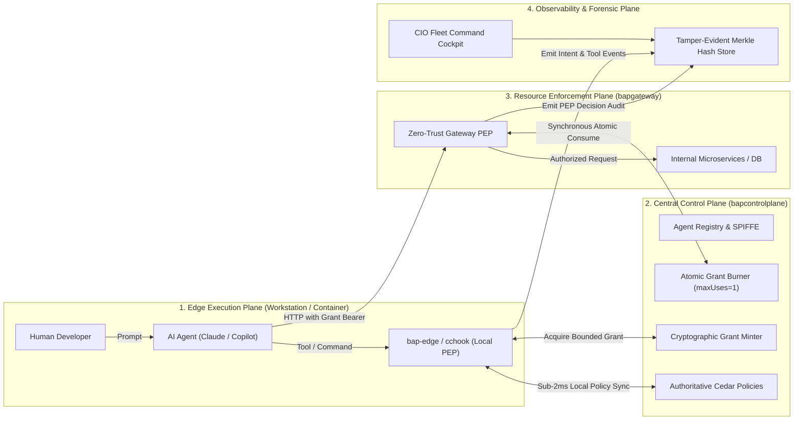

# 🛡️ Bounded Authority Plane (BAP)

### Identity, Zero Standing Privilege, and Runtime Authorization for AI Agents

> **"The human requested the work. The agent performed the action. The enterprise must be able to independently prove both, bound the blast radius to zero, and guarantee that intent is never mistaken for authority."**

BAP is an open reference architecture and implementation for governing AI agents (Claude Code, GitHub Copilot CLI, autonomous worker scripts, and MCP toolchains) that execute commands, touch source files, call APIs, and access enterprise resources.

📖 **Core Documentation Links:**
- [🌟 Strategic Vision Document (`VISION.md`)](VISION.md) — The executive problem statement, the AI agent crisis, and strategic North Star.
- [🏛️ Architecture & Technical Design (`ARCHITECTURE.md`)](ARCHITECTURE.md) — Complete 4-Plane technical architecture, state machines, and threat mitigations.
- [📁 `.bapstate` Architecture & Troubleshooting (`docs/BAPSTATE_AND_TROUBLESHOOTING.md`)](docs/BAPSTATE_AND_TROUBLESHOOTING.md) — Unified state directory, command operations, and troubleshooting playbooks.
- [📋 Jira Backlog & Stories (`JIRA_STORIES.md`)](JIRA_STORIES.md) — Complete epics, user stories, and delivery boards (BAP-100 through BAP-438).
- [🧪 10-Point Adversarial Test Matrix (`tests/test_bounded_authority_matrix.py`)](tests/test_bounded_authority_matrix.py) — 100% automated regression matrix.

---

## 🏛️ The Five Architectural Invariants (Baseline Core)

These foundational invariants define the non-negotiable security boundaries of BAP:

> **I1 — Intent is context, never authority.**  
> An agent declaring intent to "update customer 123" does not grant executable privilege to write, cancel, or modify resources. Intent provides context for policy evaluation and audit evidence, never executable permission.

> **I2 — `bap-edge` determines what authority an agent may obtain; it is not assumed to execute every resulting operation.**  
> `bap-edge` evaluates local policy and broker requests, but cannot be assumed to observe or execute every downstream HTTP/RPC call. Local intent or policy approval alone is never proof that an actual operation was authorized.

> **I3 — Actual protected operations are independently enforced at a resource-side PEP against bounded authority.**  
> Business APIs and microservices are protected by gateway Policy Enforcement Points (PEP) that derive actual actions from trusted request characteristics (HTTP method, route, parameters), validating bounded cryptographically signed grants.

> **I4 — Control Plane owns master policy, lifecycle, and centralized state; ordinary authorization must not unnecessarily depend on a synchronous Control Plane round-trip.**  
> The Control Plane distributes signed, immutable policy bundles. High-throughput edge decisions evaluate locally cached policies in sub-2ms; only operations requiring mutable state (e.g. single-use atomic consumption) hit central state.

> **I5 — Observability establishes causality and evidence across Runtime → Authority → PEP → Execution, but telemetry itself is never treated as authorization.**  
> The Observability Plane reconstructs the end-to-end timeline for forensic integrity, but telemetry reporting or health signals never substitute for cryptographic authorization tokens.

### 🛡️ Four Architecture Rules (Operations & Governance Baseline)

> **R1 — Proposals are immutable.** Correction creates lineage (`parent_proposal_id`), never mutation of existing proposals.  
> **R2 — Humans remediate inputs, never override decisions.** Changed input goes through full policy governance again. No human operator overrides authorization outcomes directly.  
> **R3 — Authorization does not prove execution.** PEP authorization and actual backend completion are separately evidenced. If network failure occurs post-authorization, state is marked `UNKNOWN` and reconciled; authorization is never assumed to be execution.  
> **R4 — Operating the governance system is itself governed.** Administrative privilege must never become the back door around bounded authority. BAP governs BAP.

**Extended Governance Chain:**
$$\text{Task} \longrightarrow \text{Intent Context} \longrightarrow \text{Action Proposal} \longrightarrow \text{Policy Decision} \longrightarrow \text{Bounded Grant} \longrightarrow \text{Gateway PEP} \longrightarrow \text{Execution} \longrightarrow \text{Evidence}$$

---

## 🧪 The 10-Point Architectural Adversarial Matrix

Every pull request and security enhancement must pass the 10 adversarial scenarios:

```text
Can a compromised or misbehaving agent:
 1. Claim a different intent?                             --> BLOCKED (I1)
 2. Modify its requested authority?                       --> BLOCKED (I3, HMAC Signature)
 3. Use a grant against another resource?                 --> BLOCKED (I3, Path Derivation)
 4. Perform an additional operation (Header Spoofing)?    --> BLOCKED (I3, deriveOperation)
 5. Reuse or over-consume a constrained grant?            --> BLOCKED (I4, Atomic Burn)
 6. Execute operations concurrently to bypass limits?     --> BLOCKED (I4, Mutex Lock)
 7. Bypass bap-edge (Tampering with policies/assets)?     --> BLOCKED (I2, Interceptor Gate)
 8. Bypass Gateway PEP (Direct unauthenticated access)?   --> BLOCKED (I3, 401 Rogue Drop)
 9. Exploit unknown or ambiguous prompts?                 --> BLOCKED (I1, UNKNOWN Safe Fallback)
10. Forge the historical audit trail?                     --> BLOCKED (I5, Merkle Hash Chain)
```

### Run the Full Matrix in 1 Second:
```powershell
python -m unittest tests/test_bounded_authority_matrix.py -v
```

---

## 🚀 System Topology: The Four Operating Planes

BAP decomposes AI agent governance into four decoupled, resilient planes:



1. **Control Plane (`bapcontrolplane`):** Authoritative Cedar policy master, SPIFFE SVID workload identity issuance, ephemeral bounded grant minting, and atomic single-use state burning.
2. **Edge Execution Broker (`bapedge` / `cchook` / `copilot`):** Embeds pure-Go AWS Cedar engine for **sub-2ms local evaluation**, enforces command containment, and deterministically classifies mission intent into 11 CIO categories.
3. **Gateway PEP (`bapgateway`):** Independent zero-trust boundary in front of business APIs. Autonomously derives required operations (`deriveOperation`) from HTTP attributes, rejects spoofed headers, and burns single-use grants.
4. **Observability Plane:** Cryptographically links `Intent -> Authority -> PEP -> Execution` into a SHA-256 Merkle chain and visualizes live fleet health on the CIO Cockpit.

---

## ⚡ Quickstart & Interactive Testing

### Option 1: Automated Regression & End-to-End Suites
```powershell
# Run complete test discovery across all 79 unit, integration & E2E tests
python -m unittest discover tests

# Run 10-stage End-to-End (E2E) Full Mission Lifecycle Suite
python -m unittest tests/test_e2e_full_lifecycle.py -v

# Run End-to-End (E2E) Adversarial & Negative Security Hardening Suite
python -m unittest tests/test_e2e_adversarial_hardening.py -v

# Run 10-point architectural adversarial test matrix
python -m unittest tests/test_bounded_authority_matrix.py -v

# Run Cedar Policy Studio & "What-If" historical replay suite
python -m unittest tests/test_cedar_policy_studio.py -v

# Run full sole-executor & process containment suite
python -m unittest tests/test_bap200_sole_executor.py -v
```

### Option 2: Live Gateway PEP & Atomic Single-Use Testing

**1. Start Control Plane & Gateway PEP:**
```powershell
# Terminal 1: Control Plane
.\dist\windows-amd64\bapcontrolplane.exe -port 8080 -secret "matrix-test-signing-key-32-chars-long-ok!" -admin-token "test-admin-secret-12345" -db memory

# Terminal 2: Gateway PEP
.\dist\windows-amd64\bapgateway.exe -port 8090 -controlplane http://127.0.0.1:8080 -secret "matrix-test-signing-key-32-chars-long-ok!" -consume=true
```

**2. Test Rogue Agent Rejection (Direct Bypass Attempt):**
```powershell
curl.exe -i http://127.0.0.1:8090/api/v1/financial-records
# Output: HTTP 401 Unauthorized (AccessDenied: Rogue agent lacking BAP Bearer Grant)
```

**3. Test Header Spoofing Rejection:**
```powershell
curl.exe -i -X POST http://127.0.0.1:8090/api/v1/financial-records -H "X-Agent-Action: financial.records.read"
# Output: HTTP 401 Unauthorized (Gateway derives 'financial.records.write' and ignores header)
```

**4. Test Anti-Tampering of Policy Assets:**
```powershell
echo '{"hook_event_name":"PreToolUse","tool_name":"Write","tool_input":{"file_path":"policy.cedar"}}' | .\dist\windows-amd64\interceptor.exe
# Output: permissionDecision: "deny" (Security Invariant Violation: Direct modification of BAP protected asset forbidden)
```

---

## 🛡️ Epic 23: Layered Endpoint Enforcement & Workstation Hardening

BAP enforces defense-in-depth across developer workstations using an explicit 3-layer security model:

```
┌────────────────────────────────────────────────────────────────────────┐
│  LAYER A: Cooperative Agent Hooks (User Space)                         │
│  - Claude Code PreToolUse hooks, Cursor MCP proxy                      │
│  - MDM locks: managed-settings.json (dangerouslySkipPermissions: false)│
│  - UX benefit: Sub-millisecond evaluation (<1ms), native in-CLI hints  │
└──────────────────────────────────┬─────────────────────────────────────┘
                                   │ (Jailbreak / Rogue Subshell Containment)
                                   ▼
┌────────────────────────────────────────────────────────────────────────┐
│  LAYER B: OS Execution & Boundary Control (Kernel / Hypervisor)        │
│  - Windows Restricted Tokens (LUA) + Job Objects (Kill-on-Close)       │
│  - Linux Landlock LSM (Filesystem Jail) + eBPF sys_enter_execve probe  │
│  - macOS Endpoint Security (AUTH_EXEC, AUTH_OPEN) + Seatbelt profiles  │
│  - Blocks hidden child subshells and theft of .env / id_rsa secrets    │
└──────────────────────────────────┬─────────────────────────────────────┘
                                   │ (Direct Bypass / Network Redirection)
                                   ▼
┌────────────────────────────────────────────────────────────────────────┐
│  LAYER C: Network Egress Pinning (Perimeter PEP)                       │
│  - Windows WFP / Linux cgroup socket filter / macOS NetworkExtension   │
│  - Direct egress to cloud microservices dropped                        │
│  - All API calls must present verified Ephemeral BAP Bearer Grants     │
└────────────────────────────────────────────────────────────────────────┘
```

### 📋 Step-by-Step Endpoint Testing Guide

You can test and verify all Layered Endpoint Hardening features step by step using any of the three methods below:

#### Option 1: Automated Integration Test Suite (Fastest)
Run the dedicated Epic 23 test suite to validate all 7 verification gates:
```powershell
python -m unittest tests/test_endpoint_layered_enforcement.py
```
**Verification Evidence:**
- `test_01_endpoint_layers_reference`: Verifies Layer A, B, and C primitive mappings across Windows, macOS, and Linux.
- `test_02_endpoint_compliance_managed_clean`: Verifies managed laptop with all 3 layers achieves `COMPLIANT` status.
- `test_03_endpoint_compliance_managed_quarantine`: Verifies missing Layer B (Kernel Control) immediately triggers `QUARANTINED`.
- `test_04_endpoint_compliance_byod_cooperative`: Verifies unmanaged BYOD operates in `COOPERATIVE_BYOD` with Gateway PEP backstop.
- `test_05_mdm_profile_generation_intune_and_jamf`: Validates Intune CSP and Jamf mobileconfig payloads.
- `test_06_biometric_step_up_challenge_and_verification`: Initiates challenge, verifies biometric attestation, mints signed `StepUpToken`, and verifies replay rejection.
- `test_07_offline_capability_classification`: Verifies Tier 1 (Safe Local Dev) is permitted offline while Tier 2 (Cloud Egress) fails closed.

---

#### Option 2: Step-by-Step Verification via REST API (`curl.exe`)

Start the Control Plane in Terminal 1:
```powershell
.\dist\windows-amd64\bapcontrolplane.exe -port 8080 -admin-token "test-admin-token-12345" -allow-remote-admin
```

In Terminal 2, run each step-by-step verification:

**Step 2.1: Inspect 3-Layer Mappings per OS:**
```powershell
curl.exe -s http://127.0.0.1:8080/api/v1/endpoint/layers?os=windows | ConvertFrom-Json
curl.exe -s http://127.0.0.1:8080/api/v1/endpoint/layers?os=darwin | ConvertFrom-Json
curl.exe -s http://127.0.0.1:8080/api/v1/endpoint/layers?os=linux | ConvertFrom-Json
```

**Step 2.2: Evaluate Managed Device Compliance & Quarantine:**
```powershell
# Non-compliant device (Missing Layer B Kernel Control):
curl.exe -s -X POST http://127.0.0.1:8080/api/v1/endpoint/compliance `
  -H "Content-Type: application/json" `
  -d '{"hostname":"rogue-laptop","agent_id":"agent-1","is_managed_fleet":true,"layers":[{"layer_id":"LAYER_A_COOPERATIVE_HOOKS","active":true,"enforcing":true},{"layer_id":"LAYER_B_KERNEL_EXECUTION_CONTROL","active":false,"enforcing":false},{"layer_id":"LAYER_C_NETWORK_EGRESS_PINNING","active":true,"enforcing":true}]}'
# Result: "compliance_state": "QUARANTINED"
```

**Step 2.3: Generate Enterprise MDM Profiles (Intune & Jamf):**
```powershell
# Microsoft Intune (Windows CSP / JSON payload):
curl.exe -s http://127.0.0.1:8080/api/v1/endpoint/mdm/profile?platform=windows | ConvertFrom-Json

# Jamf Pro (macOS configuration profile):
curl.exe -s http://127.0.0.1:8080/api/v1/endpoint/mdm/profile?platform=macos | ConvertFrom-Json
```

**Step 2.4: Test Interactive Biometric Step-Up Elevation:**
```powershell
# 1. Request Step-Up challenge for high-risk action:
$chal = curl.exe -s -X POST http://127.0.0.1:8080/api/v1/endpoint/stepup/challenge `
  -H "Content-Type: application/json" `
  -d '{"agent_id":"agent-007","operation":"database.schema_migration","risk_score":0.85}' | ConvertFrom-Json

# 2. Verify biometric signature and mint StepUpToken:
curl.exe -s -X POST http://127.0.0.1:8080/api/v1/endpoint/stepup/verify `
  -H "Content-Type: application/json" `
  -d "{`"challenge_id`":`"$($chal.challenge_id)`",`"method`":`"WINDOWS_HELLO`",`"biometric_signature`":`"valid-fingerprint-sig`"}"
```

**Step 2.5: Test Scoped Offline Capability Classification:**
```powershell
# Safe local command -> Tier 1 (Allowed offline):
curl.exe -s -X POST http://127.0.0.1:8080/api/v1/endpoint/offline/classify `
  -H "Content-Type: application/json" `
  -d '{"operation":"pytest tests/unit"}'

# Enterprise microservice egress -> Tier 2 (Fails closed offline):
curl.exe -s -X POST http://127.0.0.1:8080/api/v1/endpoint/offline/classify `
  -H "Content-Type: application/json" `
  -d '{"operation":"POST /api/v1/core-banking/transfer"}'
```

---

#### Option 3: Visual Verification in Web Dashboard Cockpit
1. Launch the interactive cockpit:
   ```powershell
   .\run_vision_demo.bat --interactive
   ```
2. Navigate to **`http://127.0.0.1:8080/dashboard`** in your browser.
3. Click the **"Endpoint Hardening"** tab:
   - **3-Layer Architecture**: Switch OS between Windows, macOS, and Linux to see active primitives.
   - **MDM Configuration Packaging**: Toggle between Microsoft Intune and Jamf Pro to inspect deployment payloads.
   - **Biometric Step-Up Sandbox**: Click **"Initiate Biometric Challenge"** and then **"Touch Biometric Authenticator"** to observe live HMAC token minting and replay rejection.
   - **Scoped Offline Degradation**: Enter any command (`cargo test`, `pytest`, `POST /api/v1/transfer`) to view the instant Tier 1 vs Tier 2 policy verdict.

---

### 9. Operational Resilience, Crash Sweeps & Developer CLI Tooling (Epic 24)

Epic 24 introduces four practical operational capabilities for developer workstations and fleet recovery:

#### 1. 1-Click Developer Setup (`bapedge setup`)
Idempotently configures local agent settings, sets `dangerouslySkipPermissions: false`, and wires the `PreToolUse` hook directly to `bapedge exec`:
```powershell
.\dist\windows-amd64\bapedge.exe setup --app claude-code
```
**Output:**
```text
  [✓] Configured .claude\managed-settings.json
      - dangerouslySkipPermissions: FALSE (Hardened by BAP)
      - pre_tool_use hook:          bapedge exec
  [✓] Configured .bap\config.json
  ✅ Workstation setup complete! Agent execution is bound to Zero-Trust Policy.
```

#### 2. In-Terminal Workstation Inspection (`bapedge status`)
Inspects active local sessions, cached Cedar policy version, 3-tier layer compliance, and offline audit spool backlog:
```powershell
.\dist\windows-amd64\bapedge.exe status
```
**Output:**
```text
  Host:             DESKTOP (windows/amd64)
  Control Plane:    https://localhost:8443
  POLICY BUNDLE & ZERO-TRUST CACHE:
    • Version:        v1
    • Rules Digest:   d70701d094...
    • Kill Switch:    false
  3-TIER LAYER COMPLIANCE STATUS:
    • Layer A (Process Interception Hooks):    COMPLIANT (bapedge exec PreToolUse hook wired)
    • Layer B (OS Kernel Boundary Sandbox):    COMPLIANT (Windows Job Objects & Restricted Tokens)
    • Layer C (Network Egress Pinning):        COMPLIANT (Gateway PEP perimeter backstop active)
  OFFLINE AUDIT STORE & RESILIENCE:
    • Spool Backlog:  0 pending entries (All audit logs ingested by Control Plane)
```

#### 3. In-Terminal Policy Decision Debugging (`bapedge why`)
Directly explains why any command is allowed or denied under local Cedar policy:
```powershell
# Safe developer action:
.\dist\windows-amd64\bapedge.exe why "git status"
# -> ✅ ALLOWED (Permitted within local workspace development boundaries)

# Dangerous action:
.\dist\windows-amd64\bapedge.exe why "rm -rf /"
# -> ⛔ DENIED (Blocked by Cedar Policy: Default deny invariant)
```

#### 4. Clean Sweep & Crash Recovery Reconciler (`bapedge sweep`)
Recovers from sudden laptop shutoffs, terminal force-kills, or power loss by purging orphaned process markers, releasing stale locks, flushing un-ingested offline audit batches, and synchronizing with the control plane (`/api/v1/control/sweep`):
```powershell
.\dist\windows-amd64\bapedge.exe sweep
```
**Output:**
```text
  [✓] Swept 2 orphaned/crashed local session markers
  [✓] Flushed 0 offline audit records to central tamper-evident ledger
  [✓] Central Control Plane reconciled: 2 idle sessions closed, 1 stale grant expired
  [✓] Workstation successfully rejoined fleet with clean state.
```

---

## 📂 Repository Structure

| Path | Purpose & Capabilities |
|---|---|
| [`bap-controlplane/`](file:///c:/Users/User/pyprj/bapltd/bap-controlplane/) | Central policy master, grant minter, atomic state burner, SQLite Merkle hash chain, and REST APIs. |
| [`bap-gateway/`](file:///c:/Users/User/pyprj/bapltd/bap-gateway/) | Resource-side Zero-Trust Gateway PEP with Envoy/Istio `ext_authz` semantics and `deriveOperation`. |
| [`bap-edge/`](file:///c:/Users/User/pyprj/bapltd/bap-edge/) | Local trusted broker with in-process Cedar engine (<1.5ms), policy cache, and offline fail-secure core. |
| [`cchook/`](file:///c:/Users/User/pyprj/bapltd/cchook/) | Managed Claude Code hooks (`SessionStart`, `UserPromptSubmit`, `PreToolUse`) with offline classifier. |
| [`copilot/`](file:///c:/Users/User/pyprj/bapltd/copilot/) | GitHub Copilot adapter wrapping `bapedge exec` with standard mission context. |
| [`python-agent/`](file:///c:/Users/User/pyprj/bapltd/python-agent/) | BAP Python SDK (`BAPSession`) and sample governed worker agents. |
| [`dist/windows-amd64/`](file:///c:/Users/User/pyprj/bapltd/dist/windows-amd64/) | Precompiled production Go binaries (`bapcontrolplane`, `bapgateway`, `bapedge`, `interceptor`, `copilot-interceptor`). |
| [`tests/`](file:///c:/Users/User/pyprj/bapltd/tests/) | Full test suites: 10-point adversarial matrix, 3,000-agent load tests, 50k perf benchmarks, and executor tests. |

---

## 🎯 One-Sentence Summary

**BAP gives every AI agent its own identity and only the authority it needs, when it needs it, while preserving human delegation and proving evidence across the entire lifecycle.**
