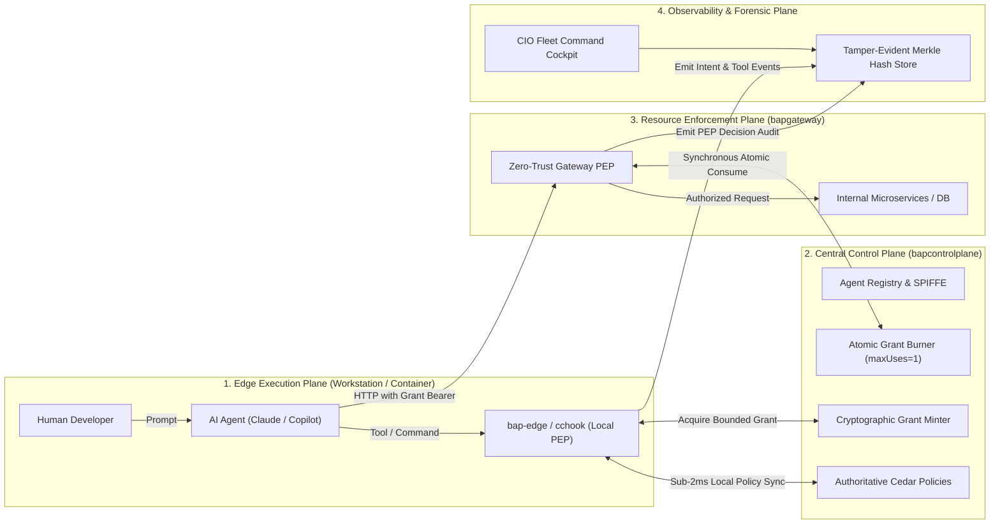

# 🛡️ Bounded Authority Plane (BAP)

### Identity, Zero Standing Privilege, and Runtime Authorization for AI Agents

> **"The human requested the work. The agent performed the action. The enterprise must be able to independently prove both, bound the blast radius to zero, and guarantee that intent is never mistaken for authority."**

BAP is an open reference architecture and implementation for governing AI agents (Claude Code, GitHub Copilot CLI, autonomous worker scripts, and MCP toolchains) that execute commands, touch source files, call APIs, and access enterprise resources.

📖 **Core Documentation Links:**
- [🌟 Strategic Vision Document (`VISION.md`)](VISION.md) — The executive problem statement, the AI agent crisis, and strategic North Star.
- [🏛️ Architecture & Technical Design (`ARCHITECTURE.md`)](ARCHITECTURE.md) — Complete 4-Plane technical architecture, state machines, and threat mitigations.
- [📋 Jira Backlog & Stories (`JIRA_STORIES.md`)](JIRA_STORIES.md) — Complete epics, user stories, and delivery boards (BAP-100 through BAP-438).
- [🧪 10-Point Adversarial Test Matrix (`tests/test_bounded_authority_matrix.py`)](tests/test_bounded_authority_matrix.py) — 100% automated regression matrix.

---

## 🏛️ The Five Architectural Invariants (Baseline Core)

These foundational invariants define the non-negotiable security boundaries of BAP:

> **I1 — Intent is context, never authority.**  
> An agent declaring intent to "update customer 123" does not grant executable privilege to write, cancel, or modify resources. Intent provides context for policy evaluation and audit evidence, never executable permission.

> **I2 — `bap-edge` determines what authority an agent may obtain; it is not assumed to execute every resulting operation.**  
> `bap-edge` evaluates local policy and broker requests, but cannot be assumed to observe or execute every downstream HTTP/RPC call. Local intent or policy approval alone is never proof that an actual operation was authorized.

> **I3 — Actual protected operations are independently enforced at a resource-side PEP against bounded authority.**  
> Business APIs and microservices are protected by gateway Policy Enforcement Points (PEP) that derive actual actions from trusted request characteristics (HTTP method, route, parameters), validating bounded cryptographically signed grants.

> **I4 — Control Plane owns master policy, lifecycle, and centralized state; ordinary authorization must not unnecessarily depend on a synchronous Control Plane round-trip.**  
> The Control Plane distributes signed, immutable policy bundles. High-throughput edge decisions evaluate locally cached policies in sub-2ms; only operations requiring mutable state (e.g. single-use atomic consumption) hit central state.

> **I5 — Observability establishes causality and evidence across Runtime → Authority → PEP → Execution, but telemetry itself is never treated as authorization.**  
> The Observability Plane reconstructs the end-to-end timeline for forensic integrity, but telemetry reporting or health signals never substitute for cryptographic authorization tokens.

### 🛡️ Four Architecture Rules (Operations & Governance Baseline)

> **R1 — Proposals are immutable.** Correction creates lineage (`parent_proposal_id`), never mutation of existing proposals.  
> **R2 — Humans remediate inputs, never override decisions.** Changed input goes through full policy governance again. No human operator overrides authorization outcomes directly.  
> **R3 — Authorization does not prove execution.** PEP authorization and actual backend completion are separately evidenced. If network failure occurs post-authorization, state is marked `UNKNOWN` and reconciled; authorization is never assumed to be execution.  
> **R4 — Operating the governance system is itself governed.** Administrative privilege must never become the back door around bounded authority. BAP governs BAP.

**Extended Governance Chain:**
$$\text{Task} \longrightarrow \text{Intent Context} \longrightarrow \text{Action Proposal} \longrightarrow \text{Policy Decision} \longrightarrow \text{Bounded Grant} \longrightarrow \text{Gateway PEP} \longrightarrow \text{Execution} \longrightarrow \text{Evidence}$$

---

## 🧪 The 10-Point Architectural Adversarial Matrix

Every pull request and security enhancement must pass the 10 adversarial scenarios:

```text
Can a compromised or misbehaving agent:
 1. Claim a different intent?                             --> BLOCKED (I1)
 2. Modify its requested authority?                       --> BLOCKED (I3, HMAC Signature)
 3. Use a grant against another resource?                 --> BLOCKED (I3, Path Derivation)
 4. Perform an additional operation (Header Spoofing)?    --> BLOCKED (I3, deriveOperation)
 5. Reuse or over-consume a constrained grant?            --> BLOCKED (I4, Atomic Burn)
 6. Execute operations concurrently to bypass limits?     --> BLOCKED (I4, Mutex Lock)
 7. Bypass bap-edge (Tampering with policies/assets)?     --> BLOCKED (I2, Interceptor Gate)
 8. Bypass Gateway PEP (Direct unauthenticated access)?   --> BLOCKED (I3, 401 Rogue Drop)
 9. Exploit unknown or ambiguous prompts?                 --> BLOCKED (I1, UNKNOWN Safe Fallback)
10. Forge the historical audit trail?                     --> BLOCKED (I5, Merkle Hash Chain)
```

### Run the Full Matrix in 1 Second:
```powershell
python -m unittest tests/test_bounded_authority_matrix.py -v
```

---

## 🚀 System Topology: The Four Operating Planes

BAP decomposes AI agent governance into four decoupled, resilient planes:



1. **Control Plane (`bapcontrolplane`):** Authoritative Cedar policy master, SPIFFE SVID workload identity issuance, ephemeral bounded grant minting, and atomic single-use state burning.
2. **Edge Execution Broker (`bapedge` / `cchook` / `copilot`):** Embeds pure-Go AWS Cedar engine for **sub-2ms local evaluation**, enforces command containment, and deterministically classifies mission intent into 11 CIO categories.
3. **Gateway PEP (`bapgateway`):** Independent zero-trust boundary in front of business APIs. Autonomously derives required operations (`deriveOperation`) from HTTP attributes, rejects spoofed headers, and burns single-use grants.
4. **Observability Plane:** Cryptographically links `Intent -> Authority -> PEP -> Execution` into a SHA-256 Merkle chain and visualizes live fleet health on the CIO Cockpit.

---

## ⚡ Quickstart & Interactive Testing

### Option 1: Automated Regression Suites
```powershell
# Run 10-point adversarial test matrix
python -m unittest tests/test_bounded_authority_matrix.py -v

# Run full sole-executor & process containment suite
python -m unittest tests/test_bap200_sole_executor.py -v

# Run Go microservice unit tests
go test ./... (in bap-controlplane, bap-gateway, bap-edge, cchook, copilot)
```

### Option 2: Live Gateway PEP & Atomic Single-Use Testing

**1. Start Control Plane & Gateway PEP:**
```powershell
# Terminal 1: Control Plane
.\dist\windows-amd64\bapcontrolplane.exe -port 8080 -secret "matrix-test-signing-key-32-chars-long-ok!" -admin-token "test-admin-secret-12345" -db memory

# Terminal 2: Gateway PEP
.\dist\windows-amd64\bapgateway.exe -port 8090 -controlplane http://127.0.0.1:8080 -secret "matrix-test-signing-key-32-chars-long-ok!" -consume=true
```

**2. Test Rogue Agent Rejection (Direct Bypass Attempt):**
```powershell
curl.exe -i http://127.0.0.1:8090/api/v1/financial-records
# Output: HTTP 401 Unauthorized (AccessDenied: Rogue agent lacking BAP Bearer Grant)
```

**3. Test Header Spoofing Rejection:**
```powershell
curl.exe -i -X POST http://127.0.0.1:8090/api/v1/financial-records -H "X-Agent-Action: financial.records.read"
# Output: HTTP 401 Unauthorized (Gateway derives 'financial.records.write' and ignores header)
```

**4. Test Anti-Tampering of Policy Assets:**
```powershell
echo '{"hook_event_name":"PreToolUse","tool_name":"Write","tool_input":{"file_path":"policy.cedar"}}' | .\dist\windows-amd64\interceptor.exe
# Output: permissionDecision: "deny" (Security Invariant Violation: Direct modification of BAP protected asset forbidden)
```

---

## 📂 Repository Structure

| Path | Purpose & Capabilities |
|---|---|
| [`bap-controlplane/`](file:///c:/Users/User/pyprj/bapltd/bap-controlplane/) | Central policy master, grant minter, atomic state burner, SQLite Merkle hash chain, and REST APIs. |
| [`bap-gateway/`](file:///c:/Users/User/pyprj/bapltd/bap-gateway/) | Resource-side Zero-Trust Gateway PEP with Envoy/Istio `ext_authz` semantics and `deriveOperation`. |
| [`bap-edge/`](file:///c:/Users/User/pyprj/bapltd/bap-edge/) | Local trusted broker with in-process Cedar engine (<1.5ms), policy cache, and offline fail-secure core. |
| [`cchook/`](file:///c:/Users/User/pyprj/bapltd/cchook/) | Managed Claude Code hooks (`SessionStart`, `UserPromptSubmit`, `PreToolUse`) with offline classifier. |
| [`copilot/`](file:///c:/Users/User/pyprj/bapltd/copilot/) | GitHub Copilot adapter wrapping `bapedge exec` with standard mission context. |
| [`python-agent/`](file:///c:/Users/User/pyprj/bapltd/python-agent/) | BAP Python SDK (`BAPSession`) and sample governed worker agents. |
| [`dist/windows-amd64/`](file:///c:/Users/User/pyprj/bapltd/dist/windows-amd64/) | Precompiled production Go binaries (`bapcontrolplane`, `bapgateway`, `bapedge`, `interceptor`, `copilot-interceptor`). |
| [`tests/`](file:///c:/Users/User/pyprj/bapltd/tests/) | Full test suites: 10-point adversarial matrix, 3,000-agent load tests, 50k perf benchmarks, and executor tests. |

---

## 🎯 One-Sentence Summary

**BAP gives every AI agent its own identity and only the authority it needs, when it needs it, while preserving human delegation and proving evidence across the entire lifecycle.**
