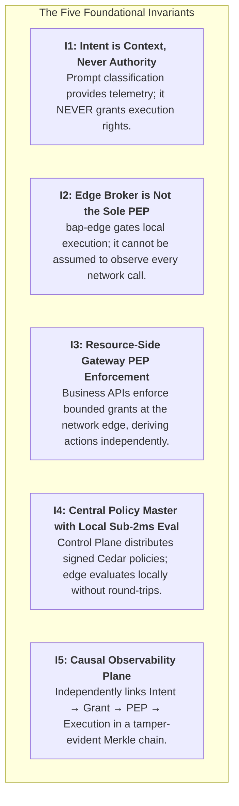
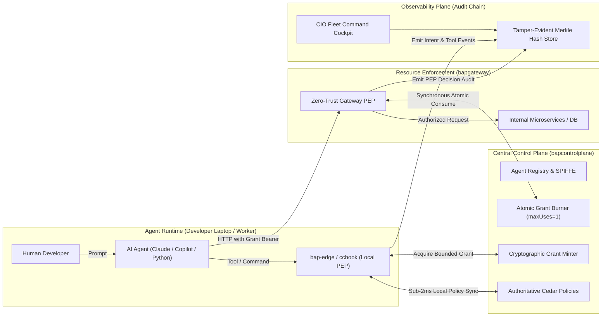
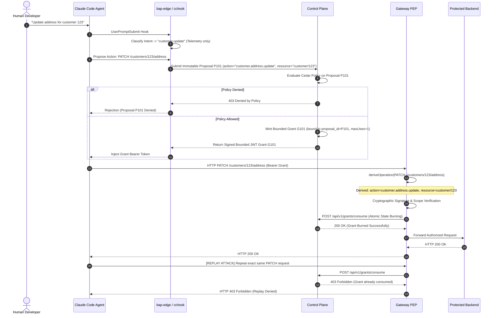

# 🌟 Bounded Authority Plane (BAP) — Vision & Strategic Architecture

> **"The human requested the work. The agent performed the action. The enterprise must be able to independently prove both, bound the blast radius to zero, and guarantee that intent is never mistaken for authority."**

---

## 1. Executive Summary: The Autonomous Agent Crisis

Enterprise engineering is experiencing an unprecedented paradigm shift: **from AI assistants that suggest text to autonomous AI agents that execute actions.** 

Today, agents like Claude Code, GitHub Copilot CLI, OpenAI Operator, and custom LangChain/AutoGen/CrewAI workers run directly on developer workstations and cloud infrastructure. They compile code, invoke shell binaries, query production databases, call cloud APIs, and manipulate internal microservices.

### The Fatal Flaws of Traditional Security Models

Traditional enterprise security models (IAM, RBAC, OAuth2, and API gateways) were designed for **humans** or **static background services**. When applied to non-deterministic, probabilistic AI agents, they break down completely:

```text
┌─────────────────────────────────────────────────────────────────────────────┐
│                      THE CURRENT ENTERPRISE AI CRISIS                       │
├─────────────────────────────────────────────────────────────────────────────┤
│ 1. Identity Conflation:                                                     │
│    Agents execute using developer credentials (SSH keys, AWS tokens, npm).  │
│    The enterprise cannot distinguish Alice's actions from an agent's bugs.  │
│                                                                             │
│ 2. The Standing Privilege Trap:                                             │
│    To be useful, agents are handed permanent API keys or admin privileges.  │
│    A single prompt injection or hallucination exposes the entire boundary.  │
│                                                                             │
│ 3. Intent as Authority Fallacy:                                             │
│    Existing agent frameworks trust LLM reasoning or prompt classification.  │
│    If Claude claims "I will inspect customer 123", the system naively grants│
│    permission, only for the model to cascade into deleting subscriptions.   │
│                                                                             │
│ 4. Autonomous Scope Creep & Cascading Tool Calls:                           │
│    An agent tasked with "Investigate latency" finds a memory leak, drops a  │
│    database index, modifies firewall rules, and commits code to main.       │
│                                                                             │
│ 5. The Local Enforcement Blindspot:                                         │
│    Relying solely on on-device agent hooks fails because the agent or code   │
│    can bypass local shims and hit internal network endpoints directly.      │
└─────────────────────────────────────────────────────────────────────────────┘
```

The **Bounded Authority Plane (BAP)** is the industry's first open reference architecture purpose-built to solve this crisis. BAP establishes **Zero Standing Privilege (ZSP)**, **Cryptographic Bounded Authority**, and **Dual Policy Enforcement Points (PEP)** for AI agent workforces.

---

## 2. Core Security Thesis & Foundational Invariants

BAP is architected around **Five Inviolable Security Invariants**:



### The Invariants Defined

1. **`I1` — Intent is context, never authority:**  
   When a user inputs *"Investigate billing bug in customer 123"*, BAP deterministically extracts the intent (`INVESTIGATION`). This classification provides forensic context and telemetry for the enterprise SOC/CIO, but **it confers zero execution privileges**. Authority is granted solely through explicit, fine-grained policy evaluation.

2. **`I2` — `bap-edge` determines what authority an agent may obtain; it is not assumed to execute every resulting operation:**  
   `bap-edge` supervises local process creation. However, enterprise architecture must assume that a rogue agent could spawn a raw socket, invoke an unmonitored Python script, or bypass local hooks. Therefore, local approval alone is **never** accepted downstream as proof of authorization.

3. **`I3` — Actual protected operations are independently enforced at a resource-side PEP:**  
   Protected business services and cloud microservices are guarded by a Zero-Trust Gateway PEP (`bapgateway` or Envoy `ext_authz`). The Gateway PEP derives the actual action and target resource directly from the HTTP request line (e.g. `PATCH /customers/123/address` $\rightarrow$ `action: customer.address.update`, `resource: customer/123`), completely ignoring any agent-provided header claims.

4. **`I4` — Control Plane owns master policy, lifecycle, and centralized state; ordinary authorization must not depend on a synchronous round-trip:**  
   The Control Plane signs and distributes immutable Cedar policy bundles. Developers maintain uninterrupted local flow with **sub-2ms local evaluation** using cached bundles. The Control Plane is only contacted synchronously when mutable centralized state is required (such as atomic single-use grant burning or enrollment).

5. **`I5` — Observability establishes causality and evidence across Runtime → Authority → PEP → Execution:**  
   Every prompt, grant issuance, PEP decision, and command execution is cryptographically linked with SHA-256 Merkle hash chaining. If telemetry fails, the system fails closed; telemetry itself is never treated as authorization.

---

### The Four Frozen Architecture Rules (Operations & Governance)

Alongside the invariants, four operational rules govern all interventions:

> **R1 — Proposals are immutable.**  
> Correction creates lineage (`parent_proposal_id`), never mutation of existing proposals.

> **R2 — Humans remediate inputs, never override decisions.**  
> An operator may correct parameters (e.g. `customer=123` instead of `124`), but the updated proposal must pass through full policy governance again. No human manually forces a `DENY` into an `ALLOW`.

> **R3 — Authorization does not prove execution.**  
> PEP authorization and downstream completion are evidenced separately. Network failures post-PEP result in `UNKNOWN` and reconciliation; authorization is never assumed to be execution.

> **R4 — Operating the governance system is itself governed.**  
> Administrative privilege must never become the back door around bounded authority. BAP governs BAP.

---

### Extended Causal Governance Chain

$$\text{Task} \longrightarrow \text{Intent Context} \longrightarrow \text{Action Proposal} \longrightarrow \text{Policy Decision} \longrightarrow \text{Bounded Grant} \longrightarrow \text{Gateway PEP} \longrightarrow \text{Execution} \longrightarrow \text{Evidence}$$

---

## 3. The 4-Plane Enterprise Architecture

BAP decomposes AI agent governance into four decoupled, resilient planes:



### Plane 1: Control Plane (`bapcontrolplane`)
- **Authoritative Policy Master:** Owns versioned, signed Cedar policies (`v1`, `v2`, ...). Supports instantaneous rollback and distribution without agent restarts.
- **Agent Identity & SPIFFE SVID:** Issues cryptographically verified workload identities (`spiffe://bap.internal/agent/{id}`) rotated periodically via mTLS.
- **Ephemeral Bounded Grant Minter:** Generates HMAC-SHA256 / Ed25519 tokens encapsulating:
  $$\text{Grant} = \langle \text{AgentID}, \text{SessionID}, \text{HumanID}, \text{Action}, \text{Resource}, \text{Constraints}, \text{TTL}, \text{PolicyVersion} \rangle$$
- **Centralized Mutable State Store:** Maintains atomic counters for single-use grants (`max_uses=1`) under strict concurrency locks.
- **Enterprise Revocation & Fleet Kill-Switch:** Provides immediate fleet-wide freeze, single-session burning, or user-level revocation propagating to edge daemons in $<100\text{ms}$.

#### Plane 2: Edge Execution Plane (`bapedge` / Interceptors)
- **Sole Executor Pattern:** Agents are stripped of raw shell execution rights. `bapedge` serves as the sole trusted broker, evaluating Cedar policies locally in $<1.5\text{ms}$.
- **3-Tier Layered Endpoint Enforcement (Epic 23):**
  - **Layer A (Application / CLI Hooks):** Claude Code (`SessionStart`, `UserPromptSubmit`, `PreToolUse`), Copilot CLI interceptors intercepting intent and proposals at the prompt/tool level.
  - **Layer B (OS Kernel & Filesystem Sandbox):** OS-level containment isolating filesystem and process boundaries (macOS Seatbelt/sandbox-exec, Linux Landlock/Bubblewrap, Windows AppContainer).
  - **Layer C (Deterministic Network Egress Pinning):** Egress filtering and localhost proxy routing (`HTTP_PROXY`/`HTTPS_PROXY`) preventing direct socket bypass to intranet and cloud APIs.
- **Biometric Elevation & Step-Up Verification:** Integrated platform authentication (Windows Hello, macOS Touch ID, FIDO2/WebAuthn) for high-impact actions (`DEPLOY_PROD`, `DROP_DB`, `SECRET_EXPORT`).
- **Deterministic Intent Classification:** Analyzes user prompts locally across canonical CIO categories (`BUG_FIX`, `DATABASE_CHANGE`, `FEATURE_ENHANCEMENT`, `INFRA_CHANGE`, `MIGRATION`, etc.). Ambiguous or unmatched inputs fail safely to `UNKNOWN` with confidence $0.0$, requiring human sign-off.
- **Enterprise MDM Delivery:** Enterprise-grade Intune and Jamf configuration profiles (`bapedge mdm-profile`) enforcing managed daemon launch daemons, locked policy directories, and non-bypassable proxy environment variables.
- **Tamper Resistance:** Prevents agents from reading `.env` secrets, deleting logs, modifying `.bap-session.json`, or altering `policy.cedar`.

### Plane 3: Resource Enforcement Plane (`bapgateway`)
- **Gateway PEP (Envoy / Istio `ext_authz` Semantics):** Sits in front of critical enterprise APIs (core banking, customer records, infrastructure services).
- **Authoritative Operation Derivation (`deriveOperation`):** Derives required actions directly from trusted HTTP protocol attributes:
  - `GET /api/v1/financial-records` $\longrightarrow$ `financial.records.read`
  - `POST /api/v1/financial-records` $\longrightarrow$ `financial.records.write`
  - `POST /api/v1/core-banking/{id}/transfer` $\longrightarrow$ `core_banking.transfer`
- **Rejection of Client Header Spoofing:** Completely disregards client-injected headers such as `X-Agent-Action: harmless-read`.
- **Atomic Grant Burning:** Verifies that grants have not expired, match the exact action and resource, and Burns them synchronously via `/api/v1/grants/consume` to prevent replay attacks.

### Plane 4: Observability Plane & Forensic Timeline
- **Causal Reconstruction:** Answers the fundamental SOC question: *“Why did the agent invoke this API?”* by linking:
  $$\text{User Prompt} \longrightarrow \text{Intent Classification} \longrightarrow \text{Grant Issuance} \longrightarrow \text{PEP Decision} \longrightarrow \text{Execution Output}$$
- **Cryptographic Merkle Hash Chaining:** Every audit event includes a SHA-256 hash of the preceding event, ensuring total tamper evidence. Altering a past log entry invalidates the chain head immediately.
- **RFC 3161 Cloud KMS Notarization:** Periodically seals Merkle root hashes against cloud cryptographic key stores (AWS KMS, Azure Key Vault, GCP Cloud KMS) for legal non-repudiation.
- **CIO Fleet Command Cockpit:** Unified single-pane-of-glass dashboard displaying 3,000+ live agents, temporal analytics windows (Live, 24h, 7d, 30d), incident isolation, and one-click fleet freeze.

---

## 4. The 10 Strategic Architecture Pillars of BAP Zero Trust

BAP operationalizes its vision through 10 concrete, testable architectural pillars verified via automated end-to-end harnesses:

```text
┌─────────────────────────────────────────────────────────────────────────────┐
│                    THE 10 PILLARS OF BAP ARCHITECTURE                       │
├─────────────────────────────────────────────────────────────────────────────┤
│  1. Workload Identity & Hardware Attestation (SPIFFE SVID + TPM 2.0 PCR)    │
│  2. Semantic Prompt Injection Defense (Invariant I1: Context vs Authority)  │
│  3. Resource-Side Gateway PEP (Authoritative Derivation & Header Rejection) │
│  4. Atomic Single-Use Grant Burning (Anti-Replay & Double-Spend Defense)    │
│  5. Immutable Action Proposals & Operator Lineage (Rules R1 - R4)           │
│  6. Shadow IT & Unmanaged Tool Discovery (Local MCP & Secret Scanners)      │
│  7. Tamper-Evident Merkle Provenance & Cloud KMS Notarization (RFC 3161)    │
│  8. Live CIO Fleet Command Cockpit & Forensic Blast Graph                   │
│  9. 3-Tier Layered Endpoint Enforcement & Biometric Step-Up (Epic 23)       │
│ 10. Operational Resilience, Crash Sweeps & Developer CLI Tooling (Epic 24)  │
│ 11. Enterprise Identity Provider Federation & OIDC Device Flow (Epic 25)    │
└─────────────────────────────────────────────────────────────────────────────┘
```

### Pillar 1: Workload Identity & Hardware Attestation
Every agent runtime is provisioned with a cryptographic SPIFFE Verifiable Identity Document (SVID) bound to a hardware root of trust (TPM 2.0 PCR quote / Secure Enclave). Standing developer tokens are never shared with autonomous models.

### Pillar 2: Semantic Prompt Injection Defense (`I1`)
User requests and LLM prompt classifications provide forensic telemetry but **zero execution authority**. Regardless of the agent's stated plan or prompt injection attack payload, privileges are granted solely through explicit, cryptographically signed Cedar policy rules.

### Pillar 3: Resource-Side Gateway PEP (`I2` & `I3`)
Downstream services reject direct execution requests lacking a bounded BAP grant. The resource-side PEP independently derives the target action and resource path from the raw HTTP protocol, completely neutralizing client-controlled headers.

### Pillar 4: Atomic Single-Use Grant Burning (`I4`)
Grants issued by the Control Plane are bounded by strict single-use (`maxUses=1`) semantics and sub-second TTLs. When presented to a Gateway PEP, they are atomically burned in centralized state, eliminating replay, double-spend, and race-condition attacks.

### Pillar 5: Immutable Proposals & Lineage Remediation (`R1`–`R4`)
Execution proposals are strictly immutable. If human operators or supervisors remediate parameters (e.g. correcting a target customer ID), remediation creates a lineage record (`parent_proposal_id`), forcing the corrected proposal back through complete policy governance.

### Pillar 6: Shadow IT & Unmanaged Tool Discovery
Edge daemons continuously inspect local agent environments for unmanaged MCP servers, rogue local tools, and exposed `.env` credential files, auto-quarantining unvetted execution pathways before damage occurs.

### Pillar 7: Tamper-Evident Merkle Provenance & RFC 3161 Notarization (`I5`)
All lifecycle events (prompt $\rightarrow$ proposal $\rightarrow$ grant $\rightarrow$ execution $\rightarrow$ evidence) form a tamper-evident SHA-256 Merkle chain. Periodic root hashes are anchored against RFC 3161 timestamp authorities and Cloud KMS keys, providing immutable forensic evidence for auditors.

### Pillar 8: Live CIO Fleet Command Cockpit & Emergency Freeze
Security operations maintain real-time visibility across thousands of active developer workstations and cloud agents. Operators can pinpoint runaway token spending or prompt anomalies and execute sub-100ms fleet-wide or session-scoped kill-switch freezes.

### Pillar 9: 3-Tier Layered Endpoint Enforcement & Biometric Step-Up (Epic 23)
Local agent processes are governed through defense-in-depth:
- **Layer A:** Application-level lifecycle interceptors (`cchook`, Copilot CLI wrapper).
- **Layer B:** OS-level kernel sandboxing (Seatbelt, Landlock, AppContainer) restricting filesystem and command execution.
- **Layer C:** Localhost egress proxy pinning enforcing that all outbound agent traffic routes through BAP verification.
- **Biometric Step-Up:** High-risk actions require real-time human biometric elevation (Windows Hello / Touch ID / FIDO2).
- **Scoped Offline Degradation:** If network connectivity to the Control Plane drops, safe local read/dev commands continue under local Cedar policy cache, while cloud and protected API egress fails closed.
- **Enterprise MDM:** Packaged Intune & Jamf profiles enforce daemon registration and tamper resistance across corporate fleets.

### Pillar 10: Operational Resilience, Crash Sweeps & Developer CLI Tooling (Epic 24)
Designed for real-world enterprise operations:
- **Clean Sweep Crash Recovery:** Idempotent sweep reconciler (`bapedge sweep` and `/api/v1/control/sweep`) purges zombie tokens, orphaned sessions, and temp locks after ungraceful terminations, enabling seamless fleet rejoin.
- **1-Click Developer Onboarding:** `bapedge setup --app=claude-code` provisions hooks, config files, and verification checks in a single idempotent command.
- **In-Terminal Policy Explanations:** `bapedge why <action> <resource>` and `bapedge status` provide instant sub-second Cedar policy attribution and daemon health diagnostics directly in the developer's terminal.
- **Resilient Spooling:** Edge audit logs spool locally in SQLite and flush to the central Merkle store upon reconnection, guaranteeing zero audit loss during transient outages.

### Pillar 11: Enterprise Identity Provider Federation & OIDC Device Flow (Epic 25)
Integrates developer agent sessions directly with enterprise identity providers:
- **RFC 8628 OIDC Device Flow:** Developers run `bapedge login` in their terminal to authenticate via corporate MFA in Microsoft Entra ID or Okta Workforce Identity Cloud without storing standing developer passwords or static API keys.
- **Native Cedar Claim Propagation:** BAP automatically passes verified corporate claims (`user_email`, `department`, `groups`) into the Cedar policy engine so organizational rules like `when { principal.department == "Finance" }` evaluate natively.
- **Dual-Mode Environment Security Model:**
  - **Dev Mode:** Control Plane supports self-service OTC generation (`/api/v1/auth/otc/dev-request`) allowing developers to spin up local agents with zero administrative overhead.
  - **Prod Mode:** Public self-service OTC creation is strictly blocked (`403 Forbidden`), reserving OTC issuance to authenticated out-of-band administrative provisioning (`/api/v1/agents/pre-register` with `X-BAP-Admin-Token`), and enforcing MFA OIDC login for interactive developer workstations.
- **Coexistence of OTC & OIDC:** The edge daemon preserves both `bapedge register --code <OTC>` for headless CI/CD runners and offline build nodes alongside `bapedge login` for interactive developer workstations.

---

## 5. The Bounded Grant Lifecycle

Unlike static OAuth bearer tokens or long-lived API keys, BAP grants are tightly bounded, ephemeral, and non-fungible:



---

## 6. The 10-Point Architectural Adversarial Matrix

BAP is verified against 10 explicit adversarial scenarios. Any architecture unable to pass this matrix cannot guarantee bounded authority:

| # | Attack Vector / Scenario | Attacker Action | BAP Defense Mechanism | Invariant Tested |
|---|---|---|---|:---:|
| **1** | **Intent Spoofing** | Agent claims harmless intent `customer.read` but requests `admin.drop_db`. | Intent is context only. Policy engine checks actual requested action against Cedar rules. | **`I1`** |
| **2** | **Grant Tampering** | Agent edits JWT claims to expand resource scope or extend expiry. | Gateway PEP verifies cryptographic HMAC-SHA256 signature. Tampered tokens fail validation. | **`I3`** |
| **3** | **Cross-Resource Token Reuse** | Agent acquires grant for `customer/123` and uses it on `subscription/789`. | Gateway PEP matches token resource against derived path. Mismatch results in `403 Forbidden`. | **`I3`** |
| **4** | **Dynamic Scope Creep** | Agent sends `POST /financial-records` with `X-Agent-Action: harmless.ping`. | Gateway PEP derives required operation strictly from HTTP method and path, ignoring headers. | **`I3`** |
| **5** | **Replay / Over-consumption** | Agent captures a valid grant and replays it after execution. | Control Plane atomically burns single-use grants (`maxUses=1`). Subsequent attempts return `403/409`. | **`I4`** |
| **6** | **Concurrent Race Conditions** | Agent fires 10 simultaneous parallel requests using a `maxUses=1` grant. | Mutex-locked atomic consumption in state store ensures **at most one** succeeds; nine are rejected. | **`I4`** |
| **7** | **Edge Broker Bypass** | Agent attempts to modify Cedar policies or delete audit logs on disk. | Hook interceptor detects attempts to touch protected BAP assets and rejects with security invariant violation. | **`I2`** |
| **8** | **Direct Gateway Bypass** | Rogue script connects directly to protected API without going through BAP. | Gateway PEP drops all requests lacking a valid BAP Grant with `401 Unauthorized`. | **`I3`** |
| **9** | **Silent Intent Exploitation** | Ambiguous, injection-laden prompt presented to classifier. | Classifier fails safely to `UNKNOWN` ($0.0$ confidence), never escalating privileges. | **`I1`** |
| **10** | **Audit Trail Forgery** | Attacker tampers with historical JSONL audit records. | Tamper-evident SHA-256 Merkle hash chain detects broken link on `/api/v1/control/chain/verify`. | **`I5`** |

---

## 7. Strategic Business Value: Why Enterprise CIOs & CISOs Choose BAP

```text
┌─────────────────────────────────────────────────────────────────────────────┐
│                       ENTERPRISE ROI & RISK REDUCTION                       │
├─────────────────────────────────────────────────────────────────────────────┤
│ 1. Instant Regulatory & Compliance Readiness:                               │
│    Meets SOC 2 Type II, FedRAMP, and ISO 27001 requirements for AI workforce│
│    non-repudiation, dual-custody authorization, and cryptographic logging.  │
│                                                                             │
│ 2. Uninhibited Developer Velocity:                                          │
│    Sub-2ms edge policy evaluation means developers experience zero lag in   │
│    Claude Code, Copilot, or Cursor IDE sessions.                            │
│                                                                             │
│ 3. Elimination of Catastrophic Blast Radius:                                │
│    Even if an LLM is 100% jailbroken via prompt injection, it can execute   │
│    only the exact single bounded operation pre-authorized by Cedar policy.  │
│                                                                             │
│ 4. Fleet-Scale Command & Emergency Response:                                │
│    Instantaneous global kill-switch empowers security operations to freeze  │
│    3,000+ active agents within 100ms during an active incident.             │
│                                                                             │
│ 5. Operational Resilience & Zero Friction:                                  │
│    Automated crash recovery sweeps, 1-click CLI onboarding, and transparent │
│    policy diagnostics eliminate developer resistance and operational drift. │
└─────────────────────────────────────────────────────────────────────────────┘
```

---

## 8. Strategic Roadmap & Production Milestones

The BAP platform has advanced through aggressive implementation phases, progressing from core protocol specification to production enterprise readiness:

### Completed Milestones (Production Baseline)
- [x] **Core Dual-PEP Engine (Epics 1–6):** Edge broker (`bapedge`), in-process Cedar evaluation engine, resource-side gateway PEP (`bapgateway`), and atomic single-use grant burning (`maxUses=1`).
- [x] **Agent Runtime Integrations (Epics 7–8):** Claude Code lifecycle hooks (`cchook`), GitHub Copilot CLI adapter, and OpenAI Operator proxying.
- [x] **Cryptographic Observability (Epics 9–13):** Merkle-chained audit ledger, RFC 3161 Cloud KMS notarization, and forensic causal graph.
- [x] **Enterprise Identity & Secretless Delegation (Epics 14–18):** SPIFFE SVID workload identity, Okta/Entra IdP federation, and dynamic credential brokering.
- [x] **CIO Fleet Command Cockpit (Epics 19–22):** Real-time web cockpit, fleet kill-switch propagation ($<100\text{ms}$), shadow IT & unmanaged MCP discovery.
- [x] **3-Tier Layered Endpoint Enforcement & Biometric Step-Up (Epic 23):** 
  - Layer A (interceptor hooks), Layer B (OS kernel/filesystem sandbox), Layer C (deterministic network egress proxy pinning).
  - Intune & Jamf enterprise MDM configuration profiles.
  - Windows Hello, Touch ID, and FIDO2 biometric elevation challenges.
  - Scoped offline degradation policy (Tier 1 safe local dev vs Tier 2 cloud egress).
- [x] **Operational Resilience & Developer CLI Tooling (Epic 24):**
  - Clean sweep crash recovery reconciler (`bapedge sweep` & `/api/v1/control/sweep`).
  - 1-click idempotent developer onboarding (`bapedge setup --app=claude-code`).
  - In-terminal policy inspection (`bapedge status` & `bapedge why <action> <resource>`).
  - Resilient offline SQLite audit spooling and Merkle reconnection flush.
- [x] **Enterprise Identity Provider Federation & OIDC Device Flow (Epic 25):**
  - RFC 8628 OAuth 2.0 / OIDC device authorization flow (`bapedge login`) integrating Microsoft Entra ID and Okta.
  - Native Cedar policy principal attribute evaluation (`principal.department`, `groups`, `email`).
  - Dual environment security model: open self-service OTC token generation in dev mode, strict lockdown to offline admin OTC and MFA OIDC login in prod mode.
  - Coexistence of OTC (`bapedge register`) and OIDC (`bapedge login`) on edge workstations.
- [x] **Cross-Platform Packaging & CI/CD Release Pipeline (Epic 26):**
  - GitHub Actions matrix compiling and signing release binaries for `darwin-arm64` (Apple Silicon), `darwin-amd64`, `linux-amd64`, `linux-arm64`, and `windows-amd64`.
  - macOS installer package (`.pkg`) with LaunchDaemon plist and Jamf Pro `.mobileconfig` configuration profile.
  - Windows Installer (`.msi`) with Microsoft Intune CSP / Win32 App deployment bundle.
  - Debian (`.deb`) package with systemd unit.
  - Cryptographic release ledger and manifest (`SHA256SUMS.txt`).

### Future Horizons
- [ ] **Linux eBPF TC/cgroups Kernel Filter Driver:** Native in-kernel socket enforcement bypassing userspace proxy configuration.
- [ ] **Windows Filtering Platform (WFP) Callout Driver:** Kernel-mode network egress firewall driver pinning for locked enterprise Windows endpoints.
- [ ] **Multi-Tenant Cross-Organizational Delegation Mesh:** Cross-enterprise BAP grant federation for B2B multi-agent autonomous collaboration.


